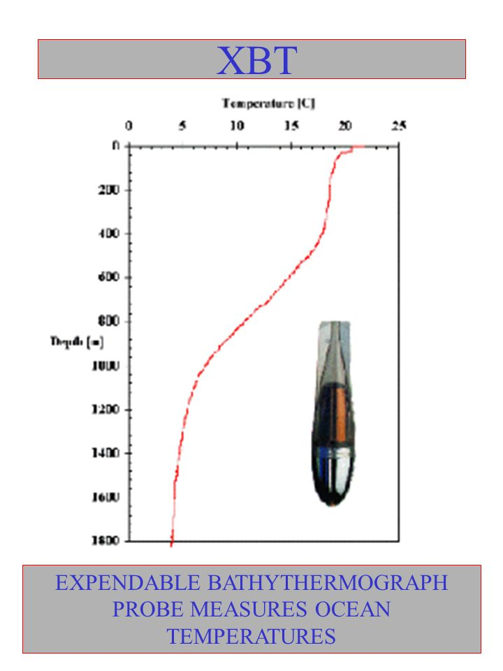

Introduction
============

XBTs: an introduction
---------------------
An XBT is a small probe that is dropped over the side of a ship. As it falls through the water, it measures temperature. Small wires transmit the temperate data back to the ship where it is recorded for further analysis.

.. image:: images/XBT_introduction/XBT_launch.jpeg
   :scale: 100%
   :align: center

Because the probe falls through the water at a known rate, the depth of the probe can be inferred from the time of launch. Scientists then plot temperature as a function of depth to create a temperature profile of the water.

Why do we need to classify XBTs?
--------------------------------
(NEED FEEDBACK FROM MATT)

Classification strategy
-----------------------
(TO DO)

Why an end-to-end system ?
--------------------------

Performing machine learning experiments in a rigorous and robust way is a quite demanding, time consuming work. Lots of time is spent studying the nature of the input features space, to identify those directions (or specific combinations of the latter) that are relevant for the prediction of output targets.

Moreover, different learning algorithms can in principle be adopted for solving a given regression, or classification, problem. This enlarges quite significantly the spectrum of computational strategies one can adopt when solving such problems.

This is why the **XBTs_classification** software has been devised. This end-to-end system allows scientists to easily process input data, select different types of learning algorithms and input spaces and rapidly check the validity of their strategies.
In this way, scientists can focus more on the statistical nature of the learning problem, while the end-to-end system takes care of the computational aspects.

The system is supposed to help scientists in their research and to boost the production of results.
